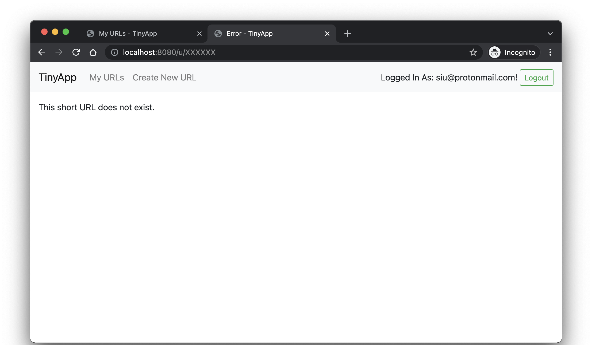
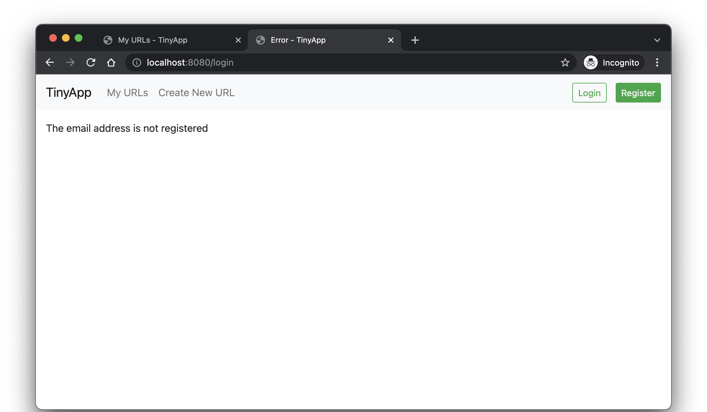
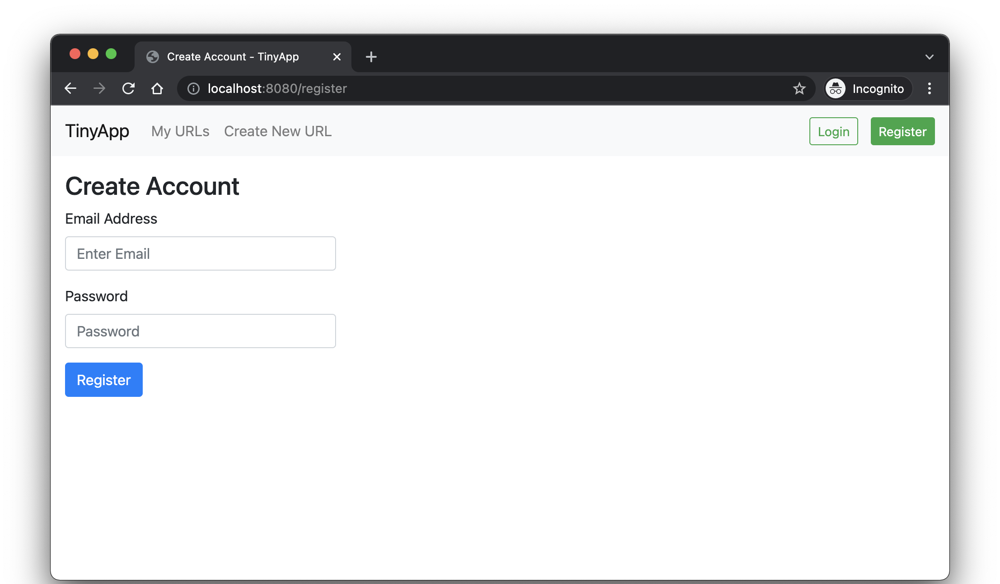

# TinyApp Project

TinyApp is a full stack web application built with Node and Express that allows users to shorten long URLs (à la bit.ly).

&nbsp;  

## Table of Content
- [Final Product](#final-product)
- [Dependencies](#dependencies)
- [Getting Started](#getting-started)
- [Features](#features)
- [File Structure](#file-structure)

&nbsp;  

## Final Product

*User can view all short URLs that are created by them*

&nbsp;  

*User can view the statistics (date created, number of visits, number of unique visitors) and edit the long URL of their short URL*

&nbsp;  

*User can keep track of the visitors that visited their short URL (in desending order of time)*

&nbsp;  

## Dependencies

- [Node.js](https://nodejs.org/en/)
- [Express](https://expressjs.com/)
- [EJS](https://ejs.co/)
- [bcrypt](https://github.com/dcodeIO/bcrypt.js)
- [body-parser](https://github.com/expressjs/body-parser)
- [cookie-session](https://github.com/expressjs/cookie-session)

&nbsp;  

## Getting Started
- Clone this project to your computer
- `cd` to the folder where this project is cloned
- Install all dependencies with `npm install` command
- Run the development web server with `node express_server.js` command
- Open the broswer and visit: [http://localhost:8080/](http://localhost:8080/)

&nbsp;  

## Features

### Site Header
 
if a user is logged in, the header shows:
- the user's email
- a logout button for logout

 
if a user is not logged in, the header shows:
- a button to the login page (/login)
- a button to the registration page (/register)

&nbsp;  

### Path `/urls`

if user is logged in, the page shows:
- a table of URLs the user has created, each list item containing:
  - a short URL
  - the short URL's matching long URL
  - the date the short URL was created
  - the number of times the short URL was visited
  - the number of unique visitors for the short URL
  - an edit button to /urls/:shortURL
  - a delete button which makes a POST request to /urls/:id/delete
- a button "Create a New Short Link" to /urls/new

&nbsp;  

 
if user is not logged in, tha page shows an error message 

&nbsp;  

### Path `/urls/new`
Generates short URL, saves it, and associates it with the user

if user is logged in, the page shows a form which contains:
- a text input field for the original (long) URL
- a submit button

&nbsp;  

### Path `/urls/:shortURL`

if user is logged in and owns the URL for the given ID, the pages shows:
- a form which contains:
  - text input field to edit the long URL
  - a submit button
- the date the short URL was created
- the number of times the short URL was visited
- the number of unique visitors for the short URL
- visitors record with visitor ID and Timestamp (in descending order of time)

&nbsp;  

if a URL for the given ID does not exist, the page shows an error message

&nbsp; 

if user is not logged in, the pages show an error message

&nbsp; 
 
if user is logged it but does not own the URL with the given ID, the pages show an error message

&nbsp;  

### Path `/u/:shortURL`
Redirects to the corresponding long URL

if URL for the given ID does not exist, the pages shows an error message 

&nbsp;  
### Path `/login`

if user is not logged in, the page shows a form which contains:
- input fields for email and password
- submit button

&nbsp; 

if email and password params don't match an existing user, the page shows an error message

&nbsp; 

if email is not registered, the page shows an error message

&nbsp; 
### Path `/register` 

if user is not logged in, the page shows a form which contains:
- input fields for email and password
- a register button

&nbsp;  
 

if email is empty, the page shows an error message

&nbsp; 

if password is empty, the page shows an error message

&nbsp; 

if email already exists, the page shows an error message

&nbsp;  

### All other (undefined) paths

if the path does not exist, the page shows an error message

&nbsp;  

## File Structure
<pre>
📦tinyapp
 ┣ 📂docs
 ┣ 📂test
 ┃ ┣ 📜authenticateUser_test.js
 ┃ ┣ 📜checkIfURLBelongsToUser_test.js
 ┃ ┣ 📜deleteURL_test.js
 ┃ ┣ 📜editURL_test.js
 ┃ ┣ 📜generateNewShortenURL_test.js
 ┃ ┣ 📜generateRandomString_test.js
 ┃ ┣ 📜getIdForNewUser_test.js
 ┃ ┣ 📜getURLInfoByShortURL_test.js
 ┃ ┣ 📜getURLsOfAnUser_test.js
 ┃ ┣ 📜getUserByEmail_test.js
 ┃ ┣ 📜getUserInfoById_test.js
 ┃ ┣ 📜makeVisitorRecords_test.js
 ┃ ┣ 📜password_test.js
 ┃ ┣ 📜uniqueKeyChecker_test.js
 ┃ ┗ 📜uniqueVisitorsCounter_test.js
 ┣ 📂views
 ┃ ┣ 📂partials
 ┃ ┃ ┗ 📜_header.ejs
 ┃ ┣ 📜urls_error.ejs
 ┃ ┣ 📜urls_index.ejs
 ┃ ┣ 📜urls_login.ejs
 ┃ ┣ 📜urls_new.ejs
 ┃ ┣ 📜urls_register.ejs
 ┃ ┗ 📜urls_show.ejs
 ┣ 📜.gitignore
 ┣ 📜README.md
 ┣ 📜constants.js
 ┣ 📜database.js
 ┣ 📜express_server.js
 ┣ 📜helpers.js
 ┣ 📜package-lock.json
 ┗ 📜package.json
 </pre>

### 📂 docs
Store images that are displayed in this README document. These images are not included on the diagram above.

### 📂 test
Store unit test for the helper functions (in helper.js).\
These test are written with [mocha](https://mochajs.org/) and [chai](https://www.chaijs.com/).

### 📂 views
Store all the [EJS](https://ejs.co/) files. Folder `partials` has only one file, `_header.ejs`. It displays the header for all other [EJS](https://ejs.co/) files.

### 📜 .gitignore
This file is to ignore the `node_modules` folder and `.DS_store`.

### 📜 README.md
This document that you are reading.

### 📜 constants.js
Store the constants, including `PORT` for the server and `KEYS` for [cookie-session](https://github.com/expressjs/cookie-session).

### 📜 database.js
Store the database of urls and users.

### 📜 express_server.js
The main file where the server is defined.

### 📜 helpers.js
Store all the helpers function.\
Functions that change the database (urls/users) are put in `userHelperGenerator` or `urlHelperGenerator` (closure) respectively.\
Functions that are used by other files are exported.

### 📜 package.json
This file contains:
- the list of dependencies (node libraries that the executable code (and development code) needs)
- dev-dependencies: node libraries only needed by development tools</li>
- scripts: Define the in-project shortcut commands, therefore when we can use `npm start`, `npm test` is equivalent to calling  script value